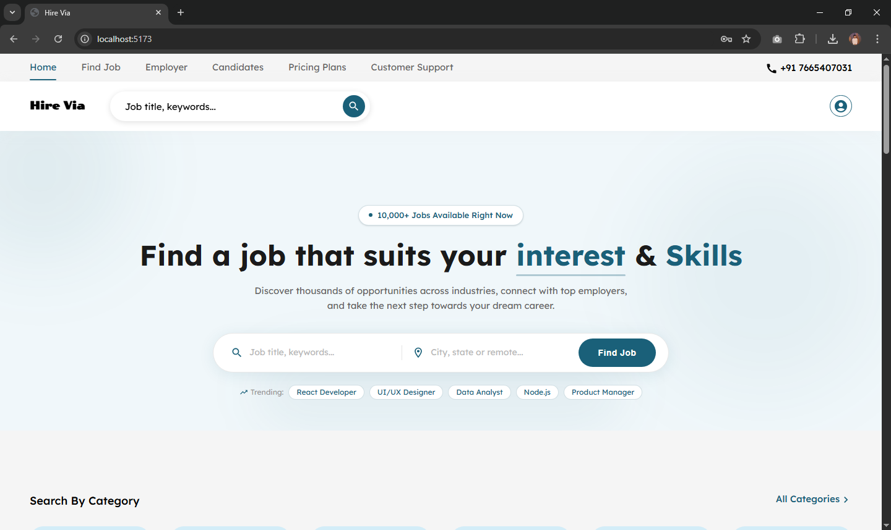
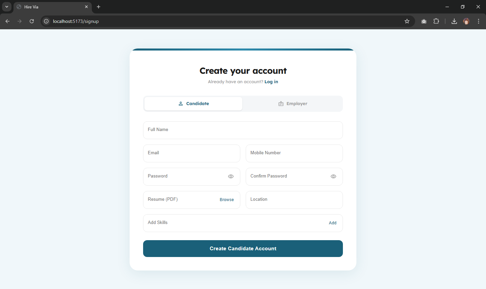
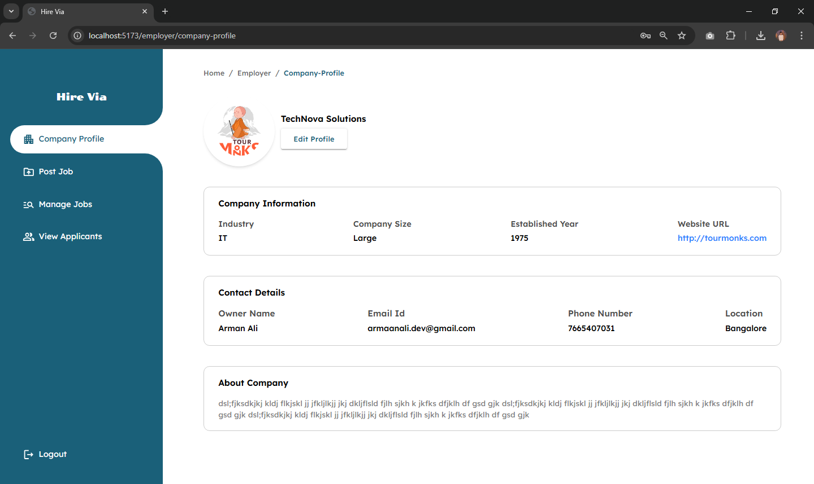
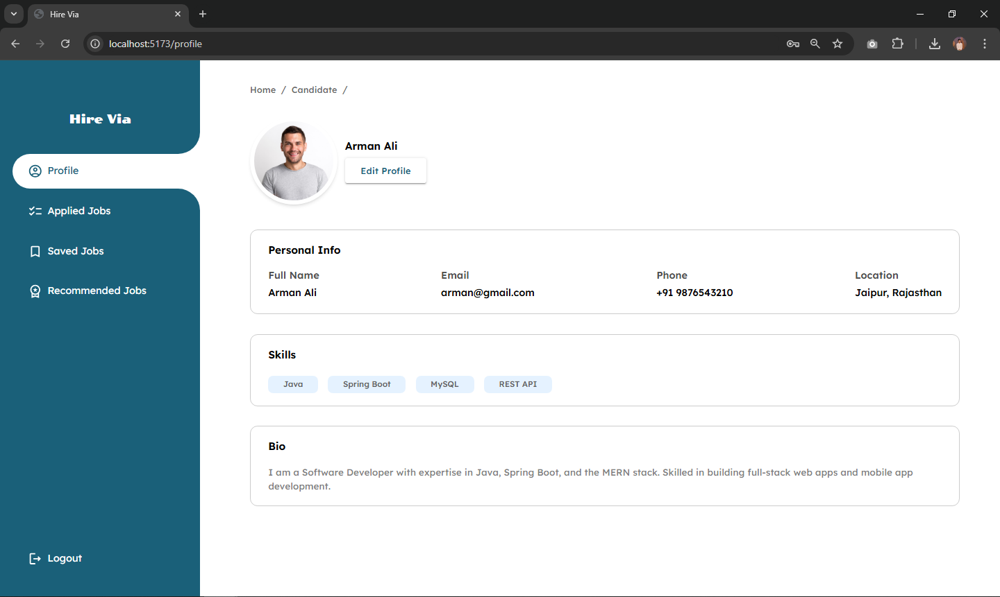

# Hire Via — Job Portal

**Hire Via is a full stack job portal where recruiters can post jobs and candidates can apply for jobs.**

</div>

## Features

### Authentication

- Secure **Login & Registration** for both Recruiters and Candidates
- Role-based access control (Recruiter / Candidate)
- JWT-based session management

### For Recruiters

- Post, edit, and delete job listings
- View and manage applicants for each job
- Dedicated recruiter dashboard with analytics

### For Candidates

- Browse and search job listings
- Apply to jobs with a single click
- Track application status in real-time

### Job Discovery

- Smart **search and filtering** by title, location, and category
- Real-time job recommendations
- Responsive UI for mobile and desktop

---

## Tech Stack

| Layer        | Technology                   |
| ------------ | ---------------------------- |
| **Frontend** | React.js, Material Ui        |
| **Backend**  | Spring Boot (Java), REST API |
| **Database** | MySQL                        |
| **Auth**     | JWT (JSON Web Tokens)        |
| **Styling**  | CSS / Tailwind CSS           |

---

## Screenshots

### Home Page



### Register Page



### Recruiter Dashboard



### Candidate Dashboard



## Installation

### Prerequisites

Make sure you have the following installed:

- [Node.js](https://nodejs.org/) (v16+)
- [Java JDK](https://www.oracle.com/java/technologies/downloads/) (v17+)
- [Maven](https://maven.apache.org/)
- [MySQL](https://www.mysql.com/) (v8+)

---

### Frontend Setup

```bash
# Navigate to frontend directory
cd frontend

# Install dependencies
npm install

# Start development server
npm start
```

> App will run on: `http://localhost:5173`

---

### Backend Setup

```bash
# Navigate to backend directory
cd backend

# Configure your database
# Edit: src/main/resources/application.properties

# Run the Spring Boot application
mvn spring-boot:run
```

> API will run on: `http://localhost:8081`

---

## Author

<div align="center">

**Arman Ali**
[LinkedIn](https://www.linkedin.com/in/armaan-ali-dev/)

</div>

---
